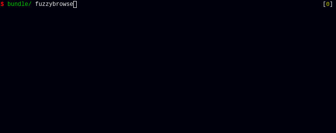
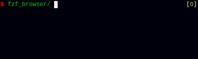

Fuzzy directory and file browser for the shell, built around fzf.



Zsh integration




Installation
------------

#### Using git (recommended)

Clone this repository (recommended location ~/.fzf_browser)
```sh
git clone https://github.com/ggVGc/fzf_browser ~/.fzf_browser
```

#### Zsh integration

Add the following line to your .zshrc
```sh
source ~/.fzf_browser/zsh_widgets.zsh
bindkey "^b" _fuzzybrowse_zsh_insert_output
```
This will bind ctrl-b to open fuzzybrowse, and insert the result in the current command line.


#### Vim plugin

Add the following line to your .vimrc. 
```vim
set rtp+=~/.fzf_browser
```

Usage
-----

#### Shell usage
| Command                | Description                                                      |
| -------------------------- | ---------------------------------------------------------------- |
| `fuzzybrowse`                   | Opens browser, and prints selected entries to stdout. |
| (Zsh only) `_fuzzybrowse_zsh_insert_output`| Should be mapped to something with bindkey(see installation example). Inserts output from `fuzzybrowse` into current command line. |

#### Vim usage
If a directory is selected, `cd` to it. If one of more files are selected, opens them for editing.

| Command                                | Description                                                      |
| -------------------------------------- | ---------------------------------------------------------------- |
| `:FuzzyBrowse``<start_dir>`           | Opens fuzzybrowse in `<start_dir>`, or current working dir if no argument is given. |
| `:FuzzyBrowseHere`                     | Same as `FuzzyBrowse`, but starts in the directory of the current buffer(regardless of current working dir) |


#### Configuration
See top of [fzf_browser.sh](https://github.com/ggVGc/fzf_browser/blob/master/fzf_browser.sh) for options/functions.

#### Key mappings:

| |     Key     |                                | Description                                                      |
| -------------------------------------- | ---------------------------------------------------------------- |
| `Enter` | If selection is directory, change to it. If it is a file, select it and exit. If multiple entries are selected, just exits(with the selections).|
| `Tab` | Select multiple files/directories.|
| `Ctrl-l` | Preview selection. By default launches a `less` in a new terminal.|
| `Ctrl-q` | Toggle showing hidden files.|
| `Ctrl-f` | Change to file-recursive mode and back. Lists all files recursively from current dir.|
| `Ctrl-v` | View current selection using xdg-open |
| `Ctrl-z` | (Currently only works if application `fasd` is available) Select recent directory and switch to it. |
| `#`/` ` ` | Go to parent directory|
| `Ctrl-h` | Go to `$HOME`|
| `Ctrl-x` | Open `$SHELL`, with `$e` containing current selection.|
| `Ctrl-e` | Opens `$EDITOR` with selection.|
| `Ctrl-c` | Abort|
| `Ctrl-o` | Go backwards in directory stack.|
| `Ctrl-u` | Go forward in directory stack.(Currently only supports one jump)|

